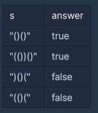

# 올바른 괄호
https://school.programmers.co.kr/learn/courses/30/lessons/12909
## 문제 설명
괄호가 바르게 짝지어졌다는 것은 '(' 문자로 열렸으면 반드시 짝지어서 ')' 문자로 닫혀야 한다는 뜻입니다. 예를 들어

"()()" 또는 "(())()" 는 올바른 괄호입니다.

")()(" 또는 "(()(" 는 올바르지 않은 괄호입니다.

'(' 또는 ')' 로만 이루어진 문자열 s가 주어졌을 때, 문자열 s가 올바른 괄호이면 true를 return 하고, 올바르지 않은 괄호이면 false를 return 하는 solution 함수를 완성해 주세요.

## 제한사항
문자열 s의 길이 : 100,000 이하의 자연수

문자열 s는 '(' 또는 ')' 로만 이루어져 있습니다.

## 입출력 예

## 입출력 예 설명
입출력 예 #1,2,3,4

문제의 예시와 같습니다.