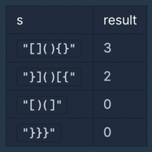
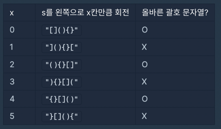
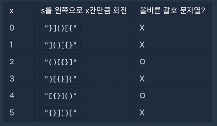

# 괄호 회전하기

https://school.programmers.co.kr/learn/courses/30/lessons/76502

## 문제 설명
다음 규칙을 지키는 문자열을 올바른 괄호 문자열이라고 정의합니다.

(), [], {} 는 모두 올바른 괄호 문자열입니다.

만약 A가 올바른 괄호 문자열이라면, (A), [A], {A} 도 올바른 괄호 문자열입니다. 예를 들어, [] 가 올바른 괄호 문자열이므로, ([]) 도 올바른 괄호 문자열입니다.

만약 A, B가 올바른 괄호 문자열이라면, AB 도 올바른 괄호 문자열입니다. 예를 들어, {} 와 ([]) 가 올바른 괄호 문자열이므로, {}([]) 도 올바른 괄호 문자열입니다.

대괄호, 중괄호, 그리고 소괄호로 이루어진 문자열 s가 매개변수로 주어집니다. 이 s를 왼쪽으로 x (0 ≤ x < (s의 길이)) 칸만큼 회전시켰을 때 s가 올바른 괄호 문자열이 되게 하는 x의 개수를 return 하도록 solution 함수를 완성해주세요.

## 제한사항
s의 길이는 1 이상 1,000 이하입니다.
## 입출력 예

## 입출력 예 설명

### 입출력 예 #1

- 다음 표는 "{}" 를 회전시킨 모습을 나타낸 것입니다.

- 올바른 괄호 문자열이 되는 x가 3개이므로, 3을 return 해야 합니다.

### 입출력 예 #2

- 다음 표는 "}]()[{" 를 회전시킨 모습을 나타낸 것입니다.

- 올바른 괄호 문자열이 되는 x가 2개이므로, 2를 return 해야 합니다.

### 입출력 예 #3

- s를 어떻게 회전하더라도 올바른 괄호 문자열을 만들 수 없으므로, 0을 return 해야 합니다.

### 입출력 예 #4

- s를 어떻게 회전하더라도 올바른 괄호 문자열을 만들 수 없으므로, 0을 return 해야 합니다.