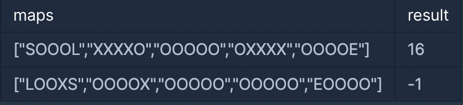
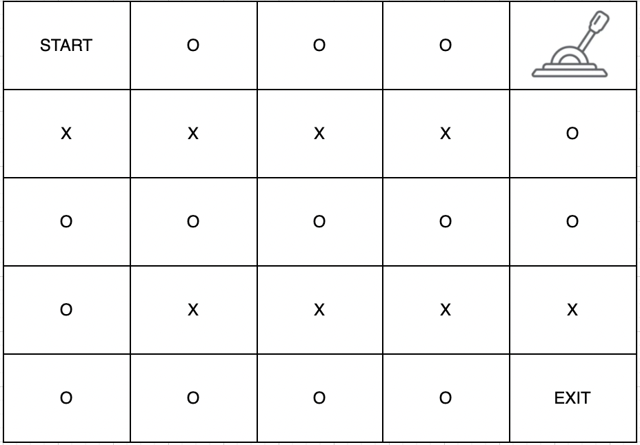
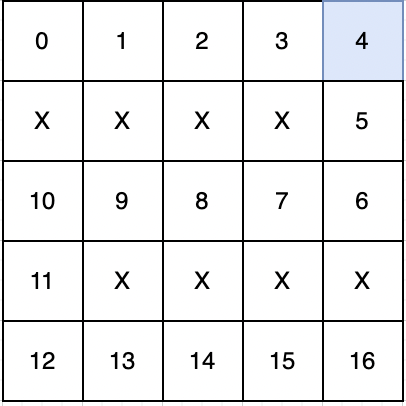
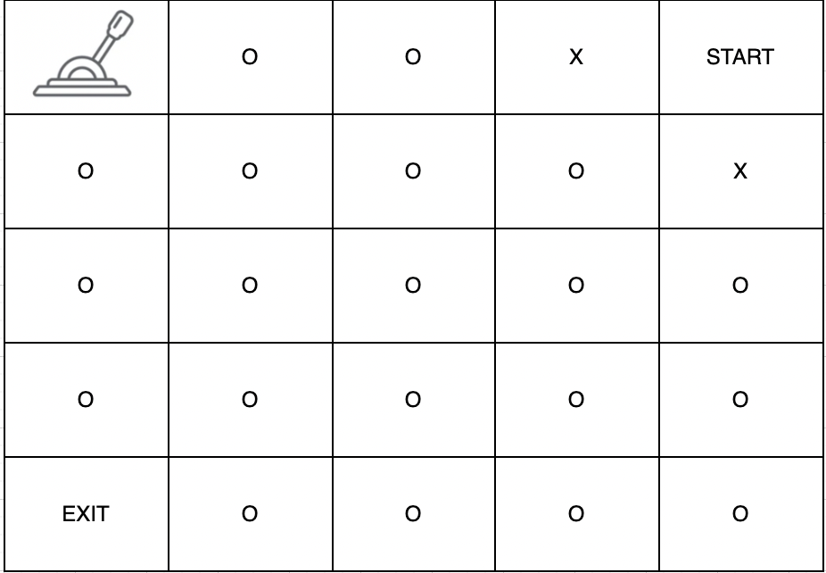

# 미로 탈출

https://school.programmers.co.kr/learn/courses/30/lessons/159993

1월 23일

### 문제풀이 생각과 과정
- 가장 최단 거리를 탐색해야하므로 bfs를 생각해봤다
- bfs를 어떻게 쓸까하다가 start-> lever, lever-> end를 따로 구현하는 별로 좋지 않은 생각을 함
- 그냥 lever를 의식하지말고 단순히 시작 시점에서 도착 지점까지의 거리 값을 계산 하면 됐음
- 2차원 배열을 사용할 때 [][] 배열의 첫번째[]는 X,Y중에 Y에 해당하는 것을 조심하고 사용하자!!! 에러 잡는데 이런데서 시간을 쓰면 안된다고 생각함.

## 문제 설명
1 x 1 크기의 칸들로 이루어진 직사각형 격자 형태의 미로에서 탈출하려고 합니다. 각 칸은 통로 또는 벽으로 구성되어 있으며, 벽으로 된 칸은 지나갈 수 없고 통로로 된 칸으로만 이동할 수 있습니다. 통로들 중 한 칸에는 미로를 빠져나가는 문이 있는데, 이 문은 레버를 당겨서만 열 수 있습니다. 레버 또한 통로들 중 한 칸에 있습니다. 따라서, 출발 지점에서 먼저 레버가 있는 칸으로 이동하여 레버를 당긴 후 미로를 빠져나가는 문이 있는 칸으로 이동하면 됩니다. 이때 아직 레버를 당기지 않았더라도 출구가 있는 칸을 지나갈 수 있습니다. 미로에서 한 칸을 이동하는데 1초가 걸린다고 할 때, 최대한 빠르게 미로를 빠져나가는데 걸리는 시간을 구하려 합니다.

미로를 나타낸 문자열 배열 maps가 매개변수로 주어질 때, 미로를 탈출하는데 필요한 최소 시간을 return 하는 solution 함수를 완성해주세요. 만약, 탈출할 수 없다면 -1을 return 해주세요.

## 제한사항
- 5 ≤ maps의 길이 ≤ 100
  - 5 ≤ maps[i]의 길이 ≤ 100
  - maps[i]는 다음 5개의 문자들로만 이루어져 있습니다.
    - S : 시작 지점
    - E : 출구
    - L : 레버
    - O : 통로
    - X : 벽
  - 시작 지점과 출구, 레버는 항상 다른 곳에 존재하며 한 개씩만 존재합니다.
  - 출구는 레버가 당겨지지 않아도 지나갈 수 있으며, 모든 통로, 출구, 레버, 시작점은 여러 번 지나갈 수 있습니다.
## 입출력 예

## 입출력 예 설명
### 입출력 예 #1

주어진 문자열은 다음과 같은 미로이며

다음과 같이 이동하면 가장 빠른 시간에 탈출할 수 있습니다.

4번 이동하여 레버를 당기고 출구까지 이동하면 총 16초의 시간이 걸립니다. 따라서 16을 반환합니다.

### 입출력 예 #2

주어진 문자열은 다음과 같은 미로입니다.

시작 지점에서 이동할 수 있는 공간이 없어서 탈출할 수 없습니다. 따라서 -1을 반환합니다.